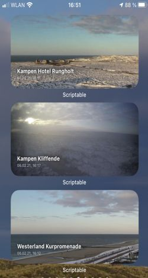

# Webcam Widgets von Sylt für das iPhone
Hier ist eine Sammlung von WebCam Widgets von Sylt. Widgets, das sind kleine Apps, die Informationen direkt auf dem Homescreen vom Smartphone darstellen und eben nicht nur das App-Symbol. 
Diese hier zeigen Bilder von WebCams auf der wundervollen Nordsee-Insel Sylt.

Für alle, die nicht auf ihre Lieblings-Insel können (wie mich 😉) bietet sich hier die Gelegenheit,Live-Bilder und Streams sehr bequem anzusehen. 
Wer aber auf die Insel reisen möchte oder sie wieder verlassen muss, der findet hier ein sehr angenehmes Angebot, sich über die Situation an den Verladestationen in Westerland oder Niebüll sowie an den Fähranlegern in List oder Havneby zu informieren.
Das macht diese Widgets so attraktiv. 

Das iPhone aktualisiert diese Bilder alle 15-20 min und damit sind die Bilder immer aktuell. 
Der Livestream der WebCam öffnet sich, wenn man das Bild antippt.

Zu allem Widgets geht es [hier entlang:](https://gist.github.com/JLuetzen)

Ihr findet da alles, den Code und die Installations-Anleitung. Ein wenig müsst Ihr noch selber machen.

Die Links hier unten führen Euch zur Installationsanleitung, zum Code nach oben scrollen. Markiert den Code von unten nach oben und lasst kein Zeichen aus.
Zu jedem Installationsschritt gibt es ein YouTube--Video, das die jeweiligen Schritte erklärt. 

<table>
  <tr>
    <th>6 Webcams Sylt am Shuttle</th>
    <th>3 WebCams Syltfähre</th>
    <th>5 Livespotting Webcams Sylt</th>
    <th>Einzelene WebCams auf Sylt</th>
  </tr>
  <tr>
    <td></td>
    <td></td>
    <td></td>
    <td></td>
  </tr>
  <tr>
    <td><a href="https://bit.ly/3dj5YcN">[Link zum Einrichten]</a></td>
    <td><a href="https://bit.ly/3eCBe7d">[Link zum Einrichten]</a></td>
    <td><a href="https://bit.ly/3b2wrsd">[Link zum Einrichten]</a></td>
    <td><a href="https://bit.ly/2LS9NKA">[Link zum Einrichten]</a></td>
  </tr>
</table>

Die einzelnen WebCams sind:
* Kampen Quermarkenfeuer
* Kampen Hotel Rungholt (Dank an Dirk Erdmann für die Unterstützung!)
* Westerlamd Kurpromenade
* Westerland Hotel Miramar

Have fun and enjoy!

-JL-

Übrigens: 
Die Firma Livespotting hat einen Blog-Eintrag zu diesem Projekt veröffentlicht: [HIER](https://livespotting.com/blog/ios-widget-fuer-livespotting-webcams-sylt)

Dickes Danke and Sven Erbeck, diese Reise geht weiter...

.
