<head>
<link rel="stylesheet" type="text/css" href="stylesheet.css">
<link rel="apple-touch-icon" sizes="180x180" href="./assets/apple-touch-icon.png">
<link rel="icon" type="image/png" sizes="32x32" href="./assets/favicon-32x32.png">
<link rel="icon" type="image/png" sizes="16x16" href="./assets/favicon-16x16.png">
<link rel="manifest" href="/site.webmanifest">

<!--- <link rel="shortcut icon" type="image/x-icon" href="./assets/favicon.png?"> --->

</head>

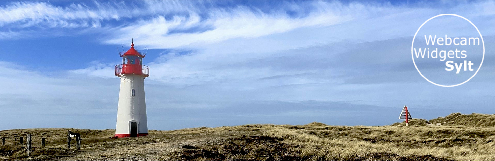

# Webcam Widgets Sylt -  live auf dem iPhone

## Einleitung
Hier ist eine Sammlung von Webcam Widgets von Sylt. Widgets, das sind kleine Apps, die Informationen direkt auf dem Homescreen vom Smartphone darstellen und eben nicht nur das App-Symbol.
Diese hier zeigen Bilder von WebCams auf der wundervollen Nordsee-Insel Sylt.

Wie das genau auf dem Smartphone aussieht, zeigt dieses Video: [https://youtu.be/xDe2LnULC7Y](https://youtu.be/xDe2LnULC7Y)



 

  
## Inhalt:
* [Eins für Alles - das Script der 2. Generation](#EinsfuerAlles)  
* [Zusammenfassung Kurzbefehle und Anleitung Einrichtung auf Homescreen](#ZusammenfassungKurzbefehle)  
* [Weitere Hinweise](#WeitereHinweise)   
* [Liste der Cams](#ListederCams)   
* ["Das will ich auch haben"](#Daswillichauch)
* [Danke an meine Unterstützer](#Danksagung)  
* [News and Updates](#NewsUpdates)
* [Lizenz](#Lizenz)

Hier kommt das neueste Zeugs... (die alten Scripte stehen unten)

  
## Eins für Alles - das Script der 2. Generation
Ab sofort steht das deutlich verbesserte Script der 2. Generation zur Verfügung!   

Die Vorteile dieser neuen Version sind
* Vereinfachtes Einrichten durch **Kurzbefehl**, dazu den Kurzbefehl unten ausführen
* Automatische Updates
* Sonnenaufgangs- und Sonnenuntergangszeiten (im Widget rechts unten)
* Nennung der Website, die die WebCam bereitstellt (im Widget rechts unten)
* erleichterte Erweiterung um neue WebCams ohne Neu-Installation 
* Bessere Benutzerunterstützung bei fehlerhafter Einrichtung
* tägliche Aktualisierung der WebCam-Listen
* News-Zeile, falls notwendig (zeigt sich dann im Widget links oberhalb Datum/Uhrzeit)

----------------------------------------------------

**Der Ablauf in in 3 Schritten:**
  1. Scriptable installieren 
  2. Update-Kurzbefehl laden und ausführen
  3. Widgets einrichten    
      3.1 Einrichten als Kurzbefehl-Menue (Webcam-Bild ansehen)     
      3.2 Einrichten auf dem Homescreen (Webcam-Bild ansehen & Livestream starten)    

Hier folgt die Schritt-für-Schritt Anleitung am Beispiel der Sylt-Cams. Weiter unten ist dann eine Zusammenfassung für <i>alle</i> Scripte, Kurzbefehle und Anleitung

-----

**1. Scriptable installieren**

Im App Store die App [Scriptable ](https://apps.apple.com/de/app/scriptable/id1405459188) auf dem iPhone installieren

-----

**2. Update-Kurzbefehl laden und ausführen**

**Einfach das Bild unten antippen** und den Kurzbefehl installieren. 
Der Kurzbefehl kopiert das Update-Scrpit auf das iPhone, danach startet es. Dieser Updater kopiert alles Notwendige auf das iPhone. Einfach und unkompliziert. Und das funktioniert auch, wenn neue Widgets verfügbar sind. Wenn sich bei den Cams etwas ändert, aktualisiert sich das Widget automatisch über Nacht.

<table class="center">
  <tr>
    <td text align="center"><a href="https://www.icloud.com/shortcuts/6159c22b53e544cfa4e8bf1cb80c89b8">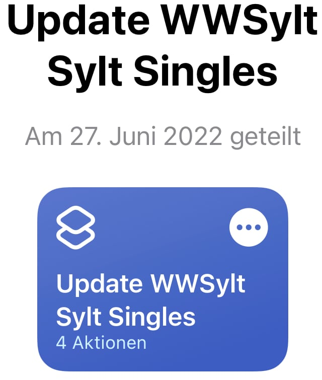</a></td>
  </tr>
</table>

-----

**3. Widgets einrichten**

#### 3.1 Einrichten als Kurzbefehl-Menue (Webcam-Bild ansehen)
    
Diese Kurzbefehle starten ein Auswahlmenue, das alle WebCams zeigt und man sucht sich die Webcam aus, deren aktuelles Bild gezeigt werden soll. Bei dieser Variante funktioniert der Livestream leider nicht. Der funktioniert nur, wenn die Widgets auf dem Homescreen eingerichtet werden, wie unter 3.2  beschrieben. Man kann auf diese Weise aber sehr schnell eben mal auf der WebCam vorbei schauen.
  

  <table class="center" width="600">
  <tr>
    <th>Kurzbefehl-Menue  Sylt-Cams</th>
    <th>Kurzbefehl-Menue Sylt-Shuttle & Fähre</th>
 </tr>
 <tr>
    <td text align="center" width="50%"><a href="https://www.icloud.com/shortcuts/664efef35fe941c18a028576b6a84c39" target="_blank" rel="noopener">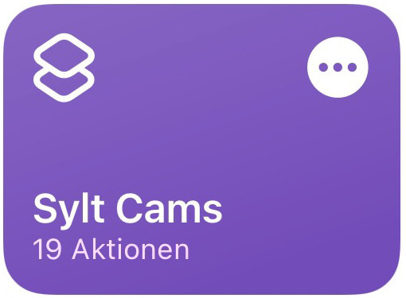</a></td>
    <td text align="center" width="50%"></td>
  </tr>
</table>  

<!---1. SyltCams [HIER den Kurzbefehl downloaden und speichern](https://www.icloud.com/shortcuts/664efef35fe941c18a028576b6a84c39)
  2. Autozug und Syltfähre: [HIER den Kurzbefehl downloaden und speichern](https://www.icloud.com/shortcuts/ad873c0c7c23400b9d0fdbc1822e7fe8)
--->

und so sieht der Aufruf des Kurzbefehls dann aus:

  <table class="center">
  <tr>
    <td text align="center"><a href="images/Kurzbefehl1.jpeg">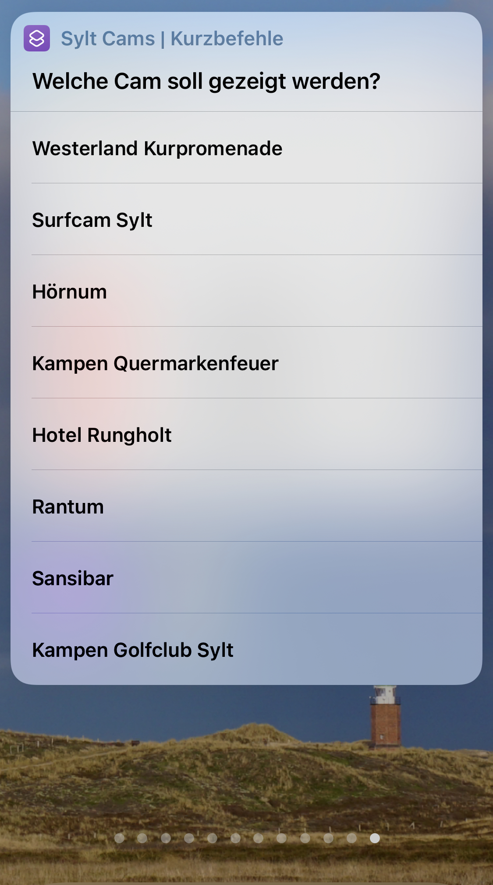</a></td>
    <td text align="center"><a href="images/Kurzbefehl2.jpeg">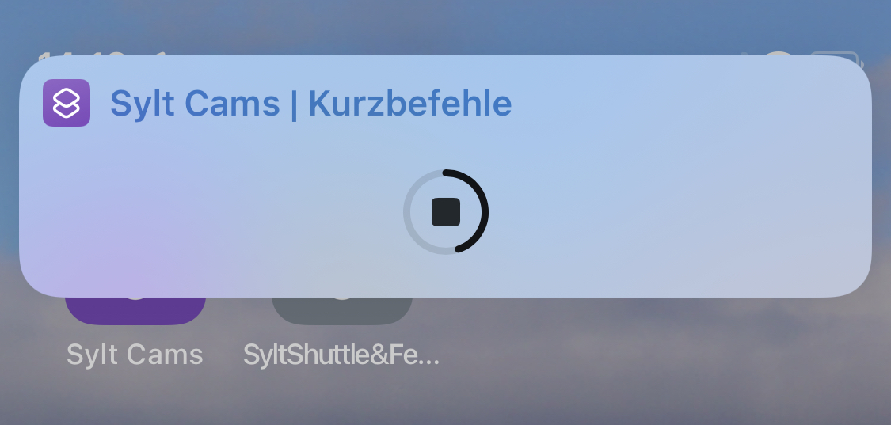</a></td>
    <td text align="center"><a href="images/Kurzbefehl3.jpeg">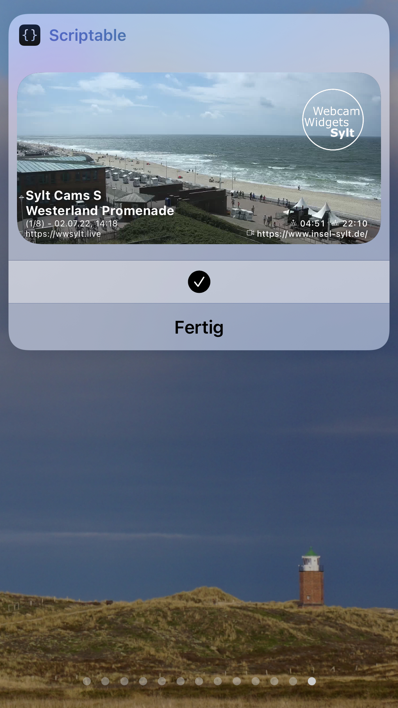</a></td>
  </tr>
</table>  

<ins>kleiner Tip:</ins>
Man kann Kurzbefehle auf den Homescreen legen.

-----

#### 3.2 Einrichten auf dem Homescreen (Webcam-Bild ansehen & Livestream starten)  
  
Das Einrichten der Widgets auf dem Homescreen bietet den vollen Funktionsumfang. Das Widget liegt dann auf dem Homescreen und der Livestream startet nach Antippen des Bildes. Mehrere Widgets können zu einem SmartStack gestapelt werden und diese Stapel sind scrollbar, wie in dem YouTube Video dargestellt. 
Der hier beschriebene Weg zum Einrichten der Widgets auf dem Homescreen ist von Apple so vorgegeben, mit der aktuellen iOS-Version geht nicht einfacher.    
So auch bestätigt vom Entwickler von Scriptable, Simon B. Støvring.   

Es wird aber im Herbst spannend, wenn iOS 16 kommt. Die Vorberichte deuten an, dass man Widgets dann auch auf den Sperrbildschirm legen kann. Das macht die Sicht auf die Cams noch angenehmer.    

Diese wenigen Schritte sind heute auszuführen:   

  1. Einmal lange auf den HomeScreen tippen, bis die Icons wackeln. Dann über das Plus-Zeichen oben ein neues Widget erstellen.
  2. Nach unten scrollen und <b>Scriptable</b> auswählen (Schneller gehts, wenn man in das Suchfenster SC eingibt...), die <i>mittlere</i> Widget-Größe auswählen und <b>Add Widget</b> antippen.
  3. Neues Widget antippen führt zu den Einstellungen
  5. Unter <b>Script</b> das neue Script auswählen, zB <i>WWS_Sylt_SurfcamSylt</i>
  6. Das war's. Jetzt oben rechts auf <b>Fertig</b> oder den HomeScreen tippen, um die Einstellung abzuschliessen.
  
 Um den Livestream zu starten, einfach das Bild auf dem Homescreen antippen.
  
 <ins>Stapeln der Bilder:</ins>
  
Wenn die Icons wackeln, ein Bild auf das andere ziehen, um einen Smart Stapel zu erzeugen, mit dem man durch die Cams mit dem Daumen durchscrollen kann. Das ist ein Smart Stack. bis zu 10 Bilder können so gestapelt werden.

  
  
Das Ergebnis kann sich sehen lassen (Tap oder Click zum Vergrößern):
<table class="center">
  <tr>
    <td text align="center"><a href="images/WWSv2-1.jpeg">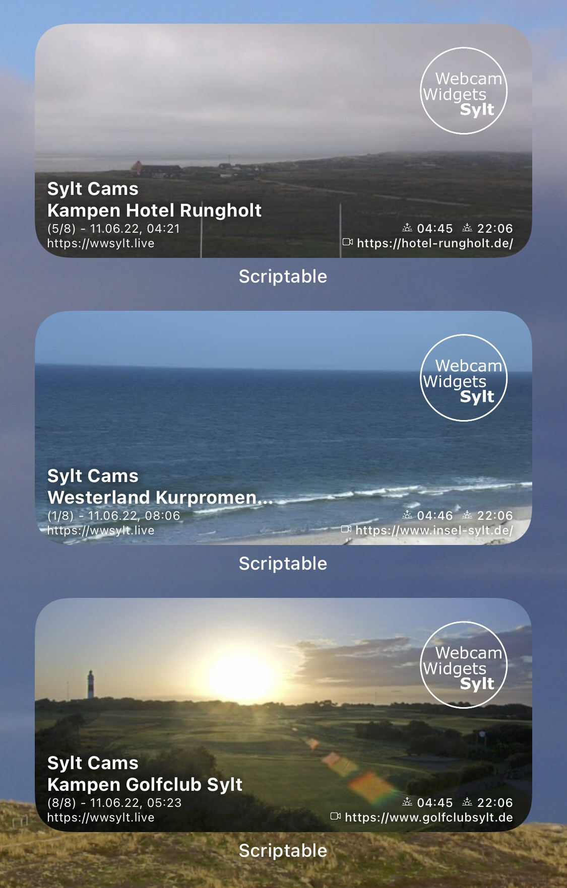</a></td>
    <td text align="center"><a href="images/WWSv2-2.jpeg">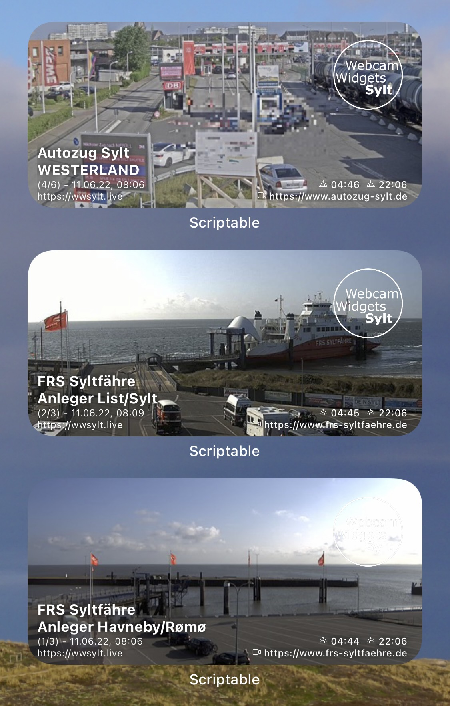</a></td>
    <td text align="center"><a href="images/WWSv2-3.jpeg">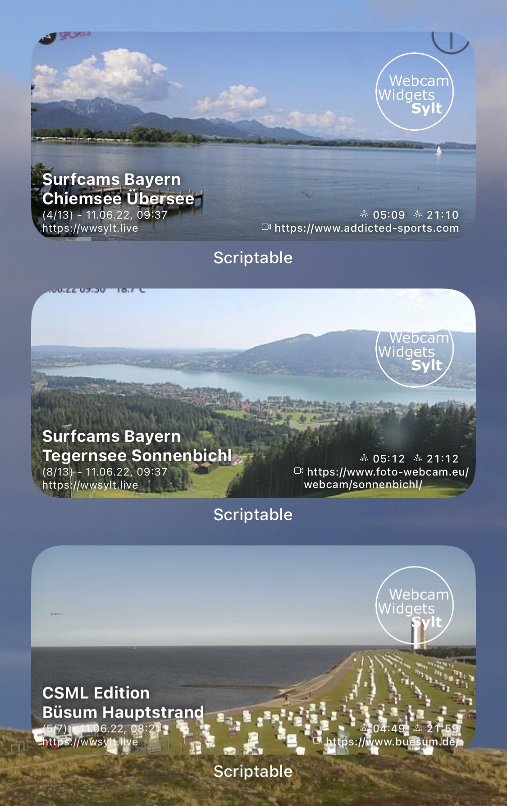</a></td>
  </tr>
</table>

Die wesentlichen Neuerungen sind, falls es interessiert, weiter unten genannt.

[Zurück zum Seitenanfang](#Top)
  
------------------------------------------------

  
## Zusammenfassung Kurzbefehle und Anleitung Einrichtung auf Homescreen      

#### Sylt-Cams

<table class="center" width="900">
  <tr>
    <th></th>
    <th>Sylt-Cams</th>
    <th>Sylt-Shuttle & Ferry</th>    
  </tr> 
  <tr>
    <td text align="center" width="20%">Kurzbefehle zum  Update der Scripte</td>
    <td text align="center" width="40%"></td>
    <td text align="center" width="40%"></td>
    
  </tr>
  <tr>
    <td text align="center">Kurzbefehl für  Cam-Menue 3.1</td>
    <td text align="center"></td>
    <td text align="center"></td>
  </tr>
  <tr>
    <td text align="center" width="20%">Anleitung für den Homescreen</td>
    <td text colspan="2" align="left" width="80%">
      1. Einmal lange auf den HomeScreen tippen, bis die Icons wackeln. Dann über das Plus-Zeichen oben ein neues Widget erstellen. 
      2. <b>Scriptable</b> auswählen, die <i>mittlere</i> Widget-Größe auswählen und <b>Add Widget</b> antippen. 
      3. Neues Widget antippen führt zu den Einstellungen 
      4. Unter "Script" das neue Script auswählen, zB <i>WWS_Sylt_SurfcamSylt</i>, fertig 
    </td>  
  </tr>  
</table>

#### Andere Cams
      
<table width="900">
  <tr>
    <th></th>
    <th>Urlaubsziele CSML</th>
    <th>Surfcams Bayern</th>
  </tr>
  <tr>
    <td text align="center" width="20%">Kurzbefehle zum  Update der Scripte</td>
    <td text align="center" width="40%"><a href="https://www.icloud.com/shortcuts/b234d6913789411abcfe1ac239799bfe" target="_blank" rel="noopener">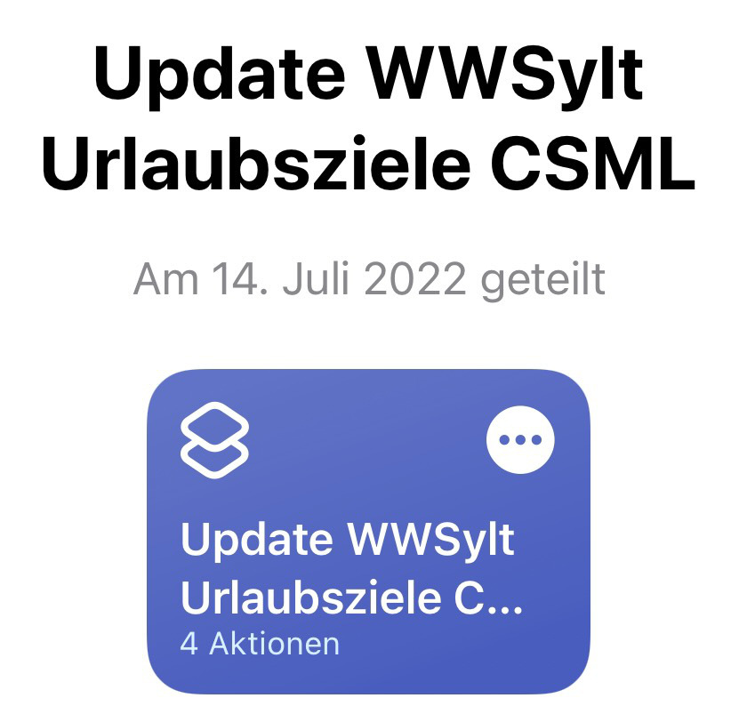</a></td>
    <td text align="center" width="40%"><a href="https://www.icloud.com/shortcuts/b58e3f131aac4e49881b4439919ed6e6" target="_blank" rel="noopener">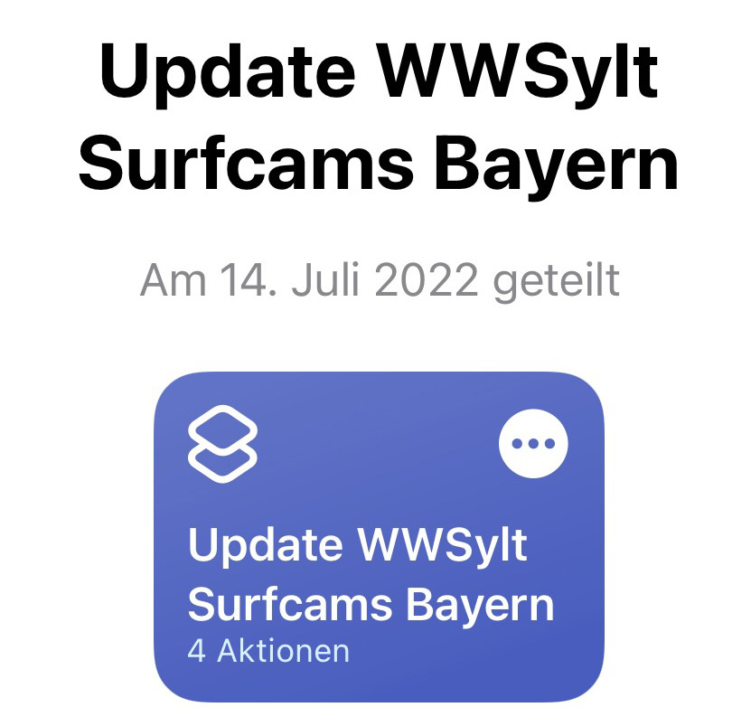</a></td>
  </tr>
  <tr>
    <td text align="center">Kurzbefehl für  Cam-Menue 3.1</td>
    <td text align="center"></td>
    <td text align="center"><a href="https://www.icloud.com/shortcuts/562b9b2a3dff43a5b687a3faa3da6e03" target="_blank" rel="noopener">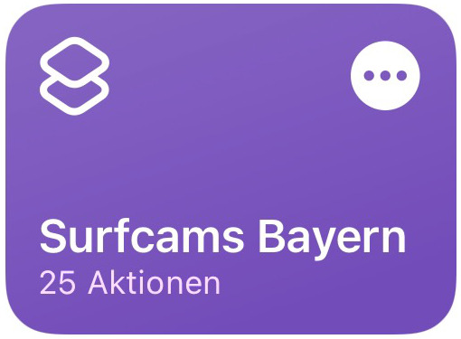</a></td>
  </tr>
  <tr>
    <td text align="center" width="20%">Anleitung für den Homescreen</td>
    <td text colspan="2" align="left" width="80%">
      1. Einmal lange auf den HomeScreen tippen, bis die Icons wackeln. Dann über das Plus-Zeichen oben ein neues Widget erstellen. 
      2. <b>Scriptable</b> auswählen, die <i>mittlere</i> Widget-Größe auswählen und <b>Add Widget</b> antippen. 
      3. Neues Widget antippen führt zu den Einstellungen 
      4. Unter "Script" das neue Script auswählen, zB <i>WWS_CSML_Buesum_Hauptstrand</i>, fertig 
    </td>  
  </tr>    
</table>

[Zurück zum Seitenanfang](#Top)
      
------------------------------------------------

      
## Weitere Hinweise
  
 
Desweiteren gibt es [dieses kommentierte](https://youtu.be/okgi-ZKg_PY) Video und vom Sylt-Shuttle [dieses unkommentierte](https://youtu.be/En-h2LZYh1w) YouTube-Video, um sich einen Eindruck zu verschaffen.

Für alle, die nicht auf ihre Lieblings-Insel können (wie ich 😉) bietet sich somit hier die Gelegenheit, Live-Bilder und Streams sehr bequem anzusehen.
Wer aber auf die Insel reisen möchte oder sie wieder verlassen muss, der findet hier ein sehr angenehmes Angebot, sich über die Situation an den Verladestationen in Westerland oder Niebüll sowie an den Fähranlegern in List oder Havneby zu informieren.
Das macht diese Widgets so attraktiv.

Das iPhone aktualisiert diese Bilder alle 15-20 min und damit sind die Bilder immer aktuell.
Der Livestream der WebCam öffnet sich, wenn man das Bild antippt.

------------------------------------------------

Richtig interessant wird es, wenn man die Bilder auf dem Homescreen kombiniert, z.B. die Bilder von der Verladestation in Niebüll mit denen vom Fähr-Anleger in Havneby.
So weiß man bei der Anreise immer, wie viel gerade los ist und ob man unter Umständen mit Wartezeiten rechnen muss.

Gleiches gilt natürlich auch für die Abreise mit der Kombination Verladestation Westerland und Fähranleger List.

Hier einmal das Beispiel für die Anreise von Ostern 2021:

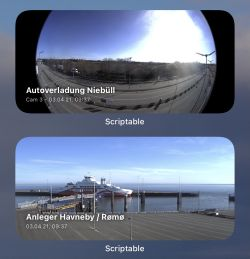

Hier noch ein paar Impressionen, wie man sich die Widgets einrichten kann:

<table class="center">
  <tr>
    <td text align="center"><a href="images/IMG_1070.jpeg">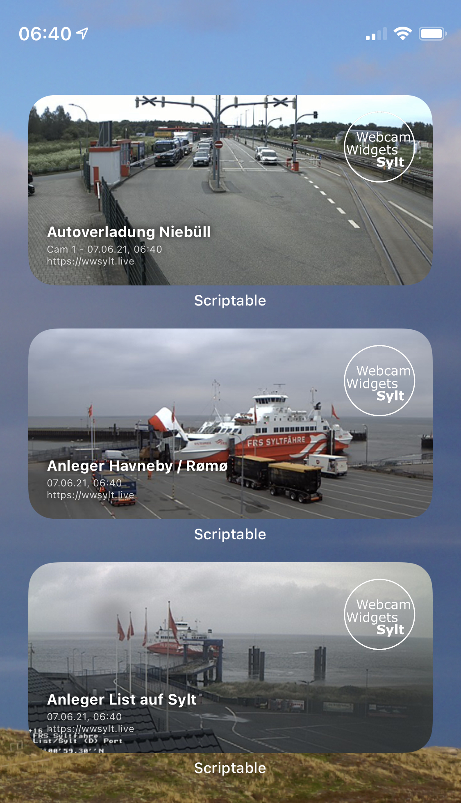</a></td>
    <td text align="center"><a href="images/IMG_1075.jpeg">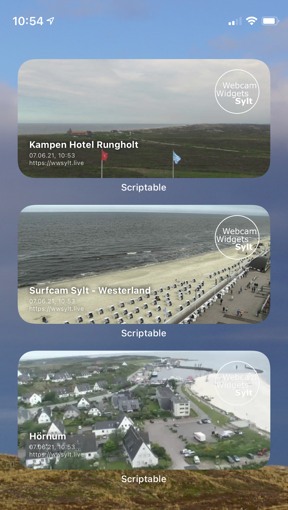</a></td>
    <td text align="center"><a href="images/IMG_1076.jpeg">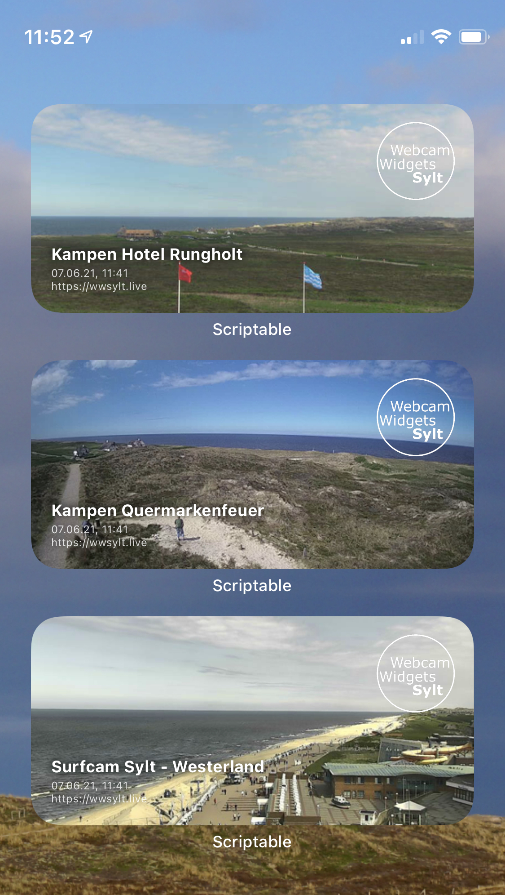</a></td>
  </tr>
</table>

Cool, oder? Now have fun and enjoy!

-JL-

------------------------------------------------
Übrigens:
Die Firma Livespotting hat einen Blog-Eintrag zu diesem Projekt veröffentlicht: [HIER](https://livespotting.com/blog/ios-widget-fuer-livespotting-webcams-sylt)

------------------------------------------------

### 2,99 € für die Kaffeedose

Wenn Euch die Widgets gefallen, würde ich mich über einen Einwurf in meine Kaffedose sehr freuen. Vielen herzlichen Dank!

Und wenn es irgendwo hakt, bei Fragen oder Problemen bin ich hier erreichbar: [kliffkieker67@gmail.com](mailto:kliffkieker67@gmail.com).

------------------------------------------------

### Aufkleber....

Ich gebe diese Aufkleber weg für 1,50 € pro Stück plus Porto (90 ct) , wenn Ihr den Betrag in die Paypal Kaffeedose einzahlt und mir per eMail Bescheid gebt.

Die Aufkleber sind rund, 7 cm Durchmesser, weiße Schrift auf transparenter Folie.

Versand erfolgt allerdings nur innerhalb Deutschlands.

[Zurück zum Seitenanfang](#Top)
      
------------------------------------------------

      
## Liste der Cams
      
### Syltcams (Stand 12.06.2022)

Diese Sylter Cams sind eingebunden:
* Westerland Kurpromendade
* Surfcam Sylt auf Hotel Miramar
* Hörnum Webcam im Leuchtturm
* Kampen Quermarkenfeuer an Kliffende
* Kampen Hotel Runghold
* Rantum Beach
* Sansibar Beach
* Kampen Golfclub Sylt

------------------------------------------------

### FRS-Syltfähre (Stand 12.06.2022)

Diese Cams der FRS Syltfähre sind abrufbar:
* Anleger Havneby/Rømø
* Anleger List/Sylt
* Anleger List/Sylt - Zoom

------------------------------------------------

### Autozug Sylt / Syltshuttle (Stand 12.06.2022)

Vom Blauen Autozug und Syltshuttle sind diese 6 WebCams wählbar:
* 3 x Autoverladung Niebüll
* 3 x Autoverladung Westerland

------------------------------------------------

### Surfcams Bayern (Stand 12.06.2022)

Auch an den Bayrischen Seen gibt es Webcams, die von Surfern genutzt werden.

Diese Seen sind eingebunden:
* Brombachsee
* Altmühlsee
* Chiemsee
* Ammersee
* Walchensee
* Kochelsee
* Starnbergersee
* Tegernsee
* Gardasee

------------------------------------------------

### CSML-Edition (Stand 12.06.2022)

Webcams im Norden...

Diese Webcams sind eingebunden:
* Sankt Peter-Ording, Badestelle Ording
* Sankt Peter-Ording, Erlebnispromenade
* Sankt Peter-Ording, Küstenpanorama
* Büsum I
* Büsum II
* Büsum Deichhausen
* Greetsiel

      
[Zurück zum Seitenanfang](#Top)
      
------------------------------------------------

## "Das will ich auch haben..."

Wenn Ihr Webcams habt, die ich Euch in Widgets einbinden soll oder für die ich Euch Widgets schreiben soll, dann meldet Euch gerne per Mail bei mir.

------------------------------------------------

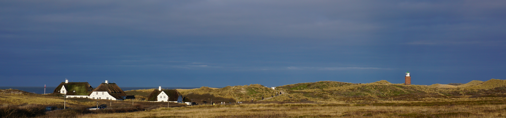

[Zurück zum Seitenanfang](#Top)
      
------------------------------------------------

      
## Danke an meine Unterstützer:
      
- Sabine
- D. Erdmann, [Hotel Rungholt](https://hotel-rungholt.de), Kampen
- C. Kochanek, [C-A Ferienwohnung Sylt](https://www.cundasylt.de), Westerland
- S. Erbeck, [Livespotting.com](https://livespotting.com)
- H.-J. Rotter, [feratel media Technologies GmbH](https://www.feratel.com/)
- D. Boysen, [Tourismus-Service Kampen](https://www.kampen.de/service/tourismus-service-kampen)      
- M. Franzen, P. Villwock, Insel Sylt Tourismus-Service, [www.insel-sylt.de](https://www.insel-sylt.de)
- A. Wagner, [SANSIBAR Sylt](https://www.sansibar.de)
- S. Bukowsky, [FRS Syltfähre](https://www.frs-syltfaehre.de)
- M. Hoppe, [www.nordwind-ev.de](https://www.nordwind-ev.de)
- [sunrise-sunset.org](https://www.sunrise-sunset.org)

------------------------------------------------
#### Hashtags:
#sylt #sychtig #syltliebe #kampensylt #einflirtfürsleben #syltfähre
#webcamwidgets #webcamwidgetssylt

[Zurück zum Seitenanfang](#Top)
      
------------------------------------------------

      
## News and Updates:

----------------------------------------------------
### 23.07.2022 Fehler beim api für Sonnenauf- und Untergangszeiten
Probleme auf dem Server zur Berechnung der Sonnenauf- und Untergangszeiten. 
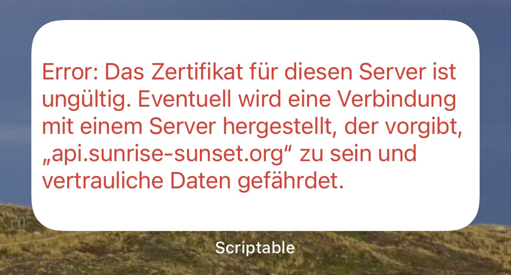  
Bitte Update-Kurzbefehle ausführen  
24.07.2022 
Der Fehler wird jetzt abgefangen und sollte nicht mehr auftreten. 
Im Bild wird im Fall erneuter Probleme der Hinweis eingeblendet, dass keine Zeiten verfügbar sind.  
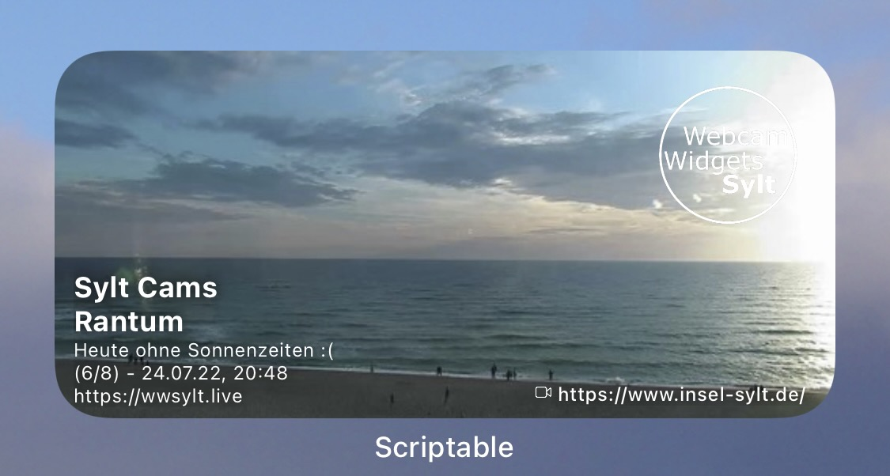     
      
----------------------------------------------------
### 2022-06-18 iPhone Nerd Version

Warum eine Nerd-Version?
  
Weils so ursprünglich programmiert war:     
Ein Widget-Script bekommt beim Aufruf eine Zahl >1 als Parameter übergeben, der beschreibt welche Zeilennummer aus der CamListe genommen werden soll.    

<ins>Vorteil:</ins>     
Man hat nur wenige Scripte auf dem iPhone.  
  
<ins>Nachteil:</ins>     
Das Einrichten auf dem Homescreen ist... sagen wir einmal .. nerdisch ;-).    
   
Daher die "Singles"-Version oben, für jede Cam gibt es genau ein Script mit einem sprechenden Namen. Das macht es kinderleicht.     
Wer es eher etwas aufgeräumt in seinem Scriptable Folder auf dem iCloud Drive mag, kann diese Version hier verwenden.     
Beim Einrichten der Widgets auf dem Homescreen dann den Wert "Parameter" mit einer Zahl ab 1 füllen, bis das Maximum erreicht wurde (steht im Widget)

Im Gist ist das auch noch einmal erklärt. [HIER](https://gist.github.com/JLuetzen/c30ec199e664938198e8f38e16a2aed6) stehts bereit.

<table class="center">
  <tr>
    <td text align="center"><a href="https://www.icloud.com/shortcuts/8d46e117081f48a89b25cfe9b9cb06ab">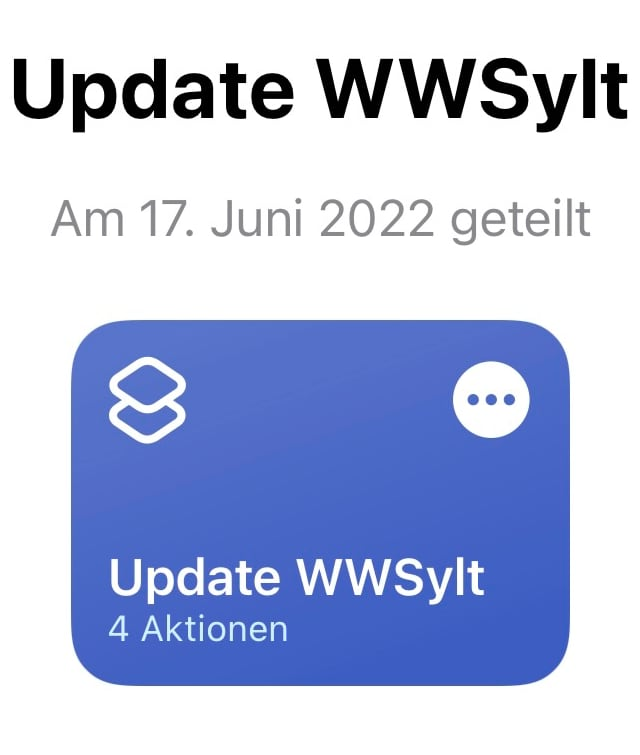</a></td>
  </tr>
</table>

------------------------------------------------
##### 2022-06-17
Erleichterte Installation durch einen iPhone Kurzbefehl. Der lädt das Update-Script und das wiederum speichert die Scripts für die Widgets wie benötigt. Das machts extrem leicht, die Widgets zu nutzen. Das Einrichten der Widgets (Homescreen drücken, bis die Symbole wackeln,...) muss erst einmal weiter von Hand gemacht werden. Aber wer weiß schon was iOS 16 kann oder ob ich nicht doch einmal eine App in den Store bringe.. ;-)

------------------------------------------------
##### 2022-06-12
*Script der 2. Generation*
Die neue Version WWS_Master.js, **das Eine für Alle** steht ab sofort zur Verfügung, eine für alles. 
Die Installation erfolgt über einen Kurzbefehl, die List der verfügbaren Cams wird dann täglich heruntergeladen. 
[Hier](https://gist.github.com/JLuetzen/c30ec199e664938198e8f38e16a2aed6) gehts zum Anschauen.
Unbedingt Aktualisieren, die Scripte der 1. Generation werden nicht mehr weiter gepflegt.

------------------------------------------------
##### 2022-02-06
*Scripts der 1. Generation*
Die geänderte Adresse der Webcam am Altmühlsee ist eingearbeitet und neu ist die WebCam an der Prienavera mit schönem Blick auf die Halbinsel, den See und das Alpenpanorama dahinter. Damit die Änderungen sichtbar werden, muss das Script "WebCams_Surfcams_Bayern" neu geladen werden, es ist [Hier](https://gist.github.com/JLuetzen/32108386834dce1f2c2de70ca597626f) zu finden.
---> Das erneute Laden entfällt bei Verwendung des Scripts der 2. Generation --> unbedingt Aktualsieren!

------------------------------------------------
##### 2021-08-20
*Scripts der 1. Generation*
Der Fehler beim Sylt Shuttle Widget mit der ausgefallenen Webcam von der Verladung in Westerland ist korrigiert. [Hier](https://bit.ly/3dj5YcN) geht's zum Widget zum Aktualisieren.
---> Das erneute Laden entfällt bei Verwendung des Scripts der 2. Generation --> unbedingt Aktualsieren!

------------------------------------------------
## Neuerungen im Script der 2. Generation

Diese Neuerungen sind in dem Script der 2. Generation **WWS_Master.js** umgesetzt:
* die Daten der Cams stehen jetzt nicht mehr im Script, sondern in einer zentralen Datei, die das Script täglich 1x aktualisiert. Dadurch kommt der Benutzer viel schneller in den Genuss neuer verfügbarer Cams. Die Textdateien mit den Daten der Cams liegen hier im [Data-Verzeichnis des GitHub Projects](https://github.com/JLuetzen/WebcamWidgetsSylt/tree/main/data)
* Die Parameter pro Script werden in einer zentralen Datei geführt, die auch täglch 1x aktualisiert wird. Damit kann zentral und schnell auf Änderungsbedarf reagiert werden, ohne das Script selber ändern zu müssen. Die Parameter-Datei _WWSmod_Paramters.js_ mit den Parametern der einzelnen Scripte liegt liegt hier im [Data-Verzeichnis des GitHub Projects](https://github.com/JLuetzen/WebcamWidgetsSylt/tree/main/data)
* Auf einigen WebCams sind die Informationen zu den WebCams oder Livestreams mit Zeitstempeln versehen. Damit ändert sich laufend der Verweis auf die WebCam und das kann zu ärgerlichen Widget-Fehlern führen. Mit der neuen Scriptversion werden die gerade gültigen Pfade zu den Medien direkt von der Website des Herstellers ausgelesen, wenn das Widget sich aktualisiert. Auch dieses Verfahren kann sich laufend ändern und deshalb wird die Datei 1x pro Tag aktualisiert. Die Parameter-Datei _WWSmod_Specialcases.js_ mit den Auslese-Routinen von den Websites liegt liegt hier im [Data-Verzeichnis des GitHub Projects](https://github.com/JLuetzen/WebcamWidgetsSylt/tree/main/data)

------------------------------------------------
## Scripts der ersten Generation
Zu allen Widgets geht es [hier entlang:](https://gist.github.com/JLuetzen)
Ihr findet da alles, den Code und die Installations-Anleitung in Text und als YouTube-Video.
Das erste Video erklärt, wie das Widget-Script von Github nach Scriptable gebracht wird: [https://youtu.be/tRHFpwIr_l0](https://youtu.be/tRHFpwIr_l0)
Das zweite Video stellt dann dar, wie danach das Widget eingerichtet wird [https://youtu.be/LnrikIM3T0U](https://youtu.be/LnrikIM3T0U) .

Ihr werdet sehen, das ist alles sehr einfach.

<table class="center">
  <tr>
    <th>7 Webcams Livespotting & andere von Sylt</th>
    <th>6 Webcams Autozug Sylt-Shuttle</th>
    <th>3 WebCams Syltfähre</th>
  </tr>
  <tr>
    <td text align="center"></td>
    <td text align="center">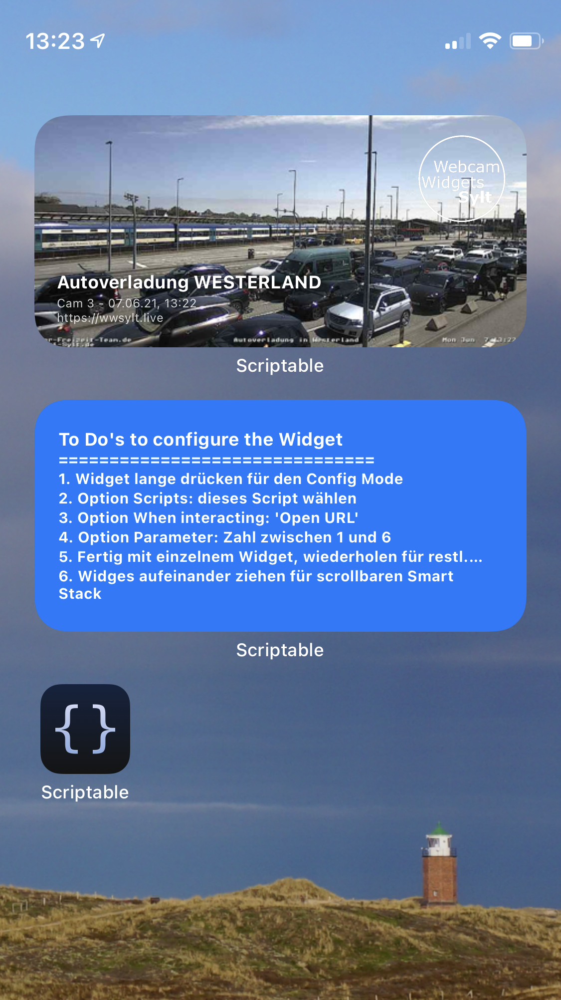</td>
    <td text align="center">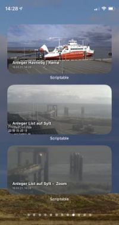</td>

  </tr>
  <tr>
    <td text align="center"><a href="https://bit.ly/3b2wrsd">[Link zum Einrichten]</a></td>
    <td text align="center"><a href="https://bit.ly/3dj5YcN">[Link zum Einrichten]</a></td>
    <td text align="center"><a href="https://bit.ly/3eCBe7d">[Link zum Einrichten]</a></td>
  </tr>
</table>

 
[Zurück zum Seitenanfang](#Top)
      
------------------------------------------------

     
## Lizenz:

Dieses Projekt ist lizensiert nach der [BSD 3-Clause "New" or "Revised" License](https://github.com/JLuetzen/WebcamWidgetsSylt/blob/main/LICENSE)

